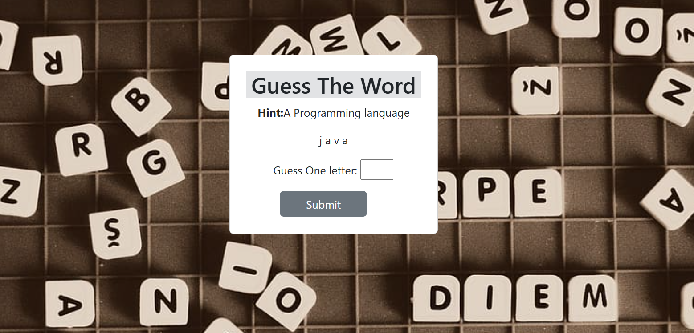
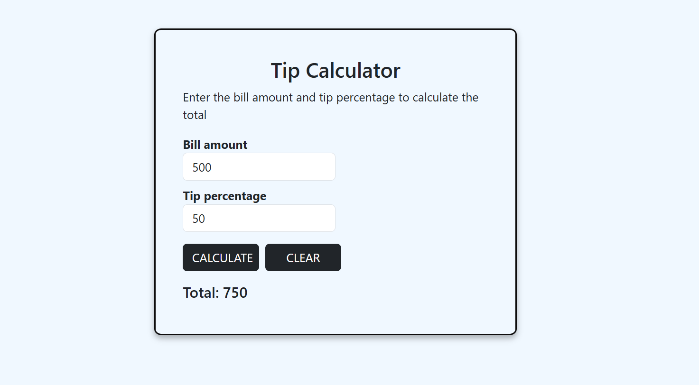
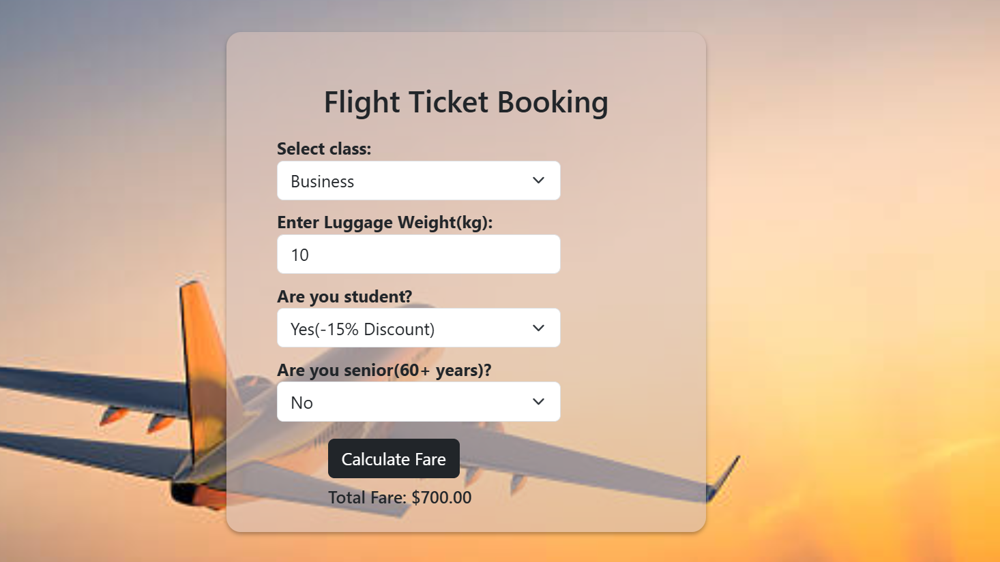
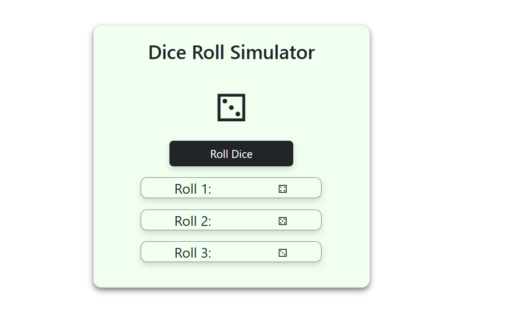
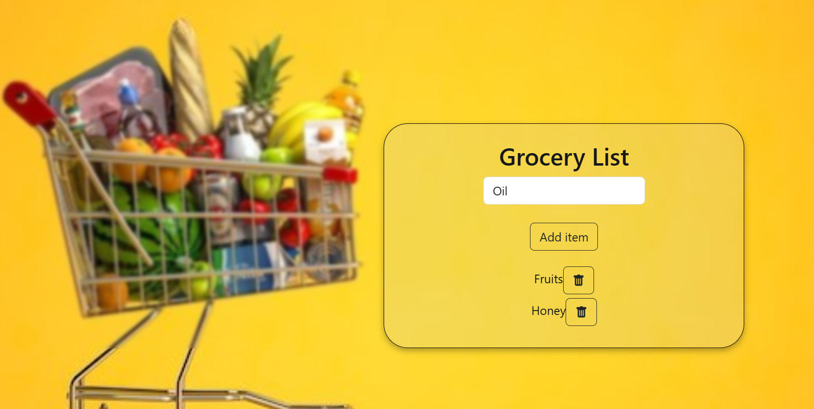

#My web development project.  
Welcome to my github repository.  
This repo contains multiple web project build using HTML, CSS, Javascript, Jquery and BootStrap  

Mini Projects using HTML, CSS, Bootstrap & JavaScript  
📌 Overview  
This repository contains a collection of small projects I built using HTML, CSS, Bootstrap, and JavaScript to improve my frontend development skills. Each project focuses on different concepts such as DOM manipulation, user interaction, and UI design.  

🛠️ Technologies Used  

-HTML – Structure the content  
-CSS & Bootstrap – Styling and responsiveness  
-JavaScript – Logic and interactivity  

📂 Projects Included  
🎯 Word Guessing Game – A fun game where users guess a word letter by letter.  
💰 Tip Calculator – Calculate tips easily based on the bill amount and percentage.   
✈️ Flight Ticket Booking UI – A simple interface for selecting and booking flight tickets.  
🎲 Dice Roll Simulator – Simulates a dice roll with random outcomes.  
🛒 Grocery List Manager – Allows users to add, remove, and manage their shopping list.  
📅 Age Calculator – Calculates age in years, months, and days based on the birthdate.  

## 📸 Screenshots  

### Word Guessing Game  
  

### Tip Calculator  
  

### Flight Ticket Booking  
  
 
### Dice Roll Simulator  
  

### Grocery List Manager   
  

### Age Calculater  
  

Features:
1. Responsive design
2. Interactive UI
3. Validations & Form Handling
4. Dynamic Functionality

🎯 What I Learned
How to use Bootstrap for responsive design
Enhancing UI with CSS animations & styling
Implementing JavaScript DOM manipulation & event handling
Creating interactive elements like buttons, forms, and lists